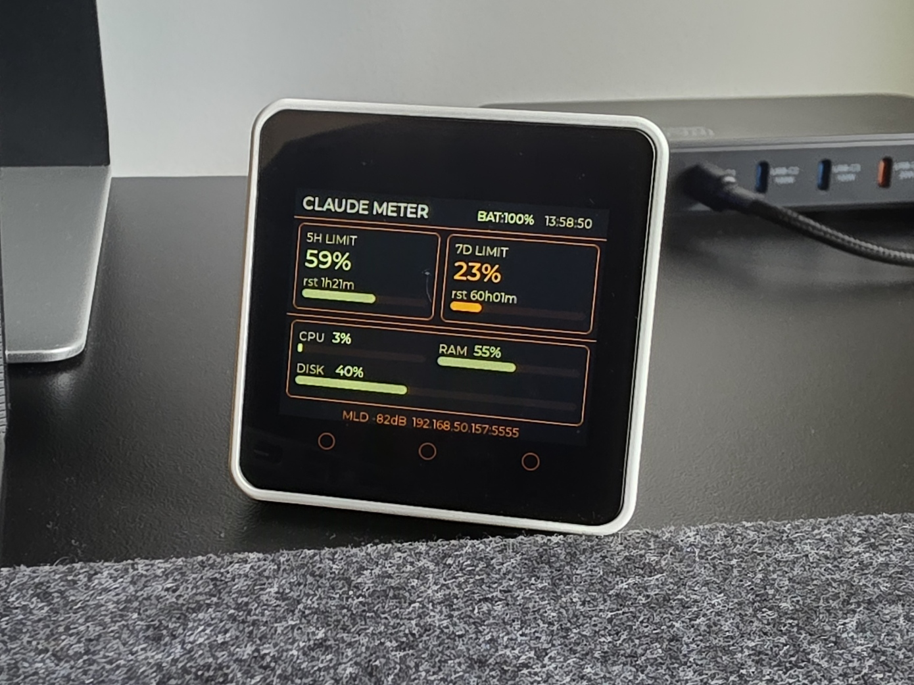

# Claude Meter

A physical dashboard for Claude Code rate-limit usage. A Python poller on your PC pushes live stats to an **M5Stack Core2** over Wi-Fi.



## How it works

```
  api.anthropic.com        Your PC                  M5Stack Core2
  ─────────────────        ──────────────────────   ─────────────────
  ◄── POST /v1/messages ───  host/main.py
  ──── rate-limit headers ►  └── claude_api.py
                             └── layout.py ──────── layout frame (once)
                             └── psutil    ──────── update frame (every 5s)
                                                    device/main.py
                                                    └── LVGL display
```

- `host/main.py` fires a minimal API request every 30 s and reads the `anthropic-ratelimit-unified-*` response headers — no prompt is processed.
- On first connect it sends a **layout frame** (card positions, widget types, colors) derived from `layout.json`.
- Every 5 s it sends an **update frame** with the current values: 5h/7d utilization %, reset countdowns, CPU, RAM, disk, battery.
- The device replies `OK\n` to each frame. If the connection drops, the layout is re-sent automatically on reconnect.

## Display layout

```
┌─────────────────────────────────────────┐
│ CLAUDE METER            14:32:07        │  header (fixed)
│ MyNetwork -62dB         BAT:87%         │
├─────────────────────────────────────────┤
│ ┌── 5H LIMIT ──┐  ┌── 7D LIMIT ──────┐ │
│ │ 42%          │  │ 18%              │ │
│ │ rst 1h23m    │  │ rst 3d08h        │ │
│ │ ████░░░░░░░░ │  │ ██░░░░░░░░░░░░░░ │ │
│ └──────────────┘  └──────────────────┘ │
│ ┌── PC STATUS ───────────────────────┐ │
│ │ CPU  22%      RAM  61%             │ │
│ │ ████░░░░░░    ██████░░░░░          │ │
│ │ DISK 48%      BAT  87%             │ │
│ │ ████░░░░░     ████████░░           │ │
│ └────────────────────────────────────┘ │
└─────────────────────────────────────────┘
```

## Repository layout

```
claude_meter/
├── host/
│   ├── main.py         # poller entry point
│   ├── claude_api.py   # token reading + API polling
│   └── layout.py       # loads layout.json, caches, sends to device
├── device/
│   └── main.py         # MicroPython firmware for M5Stack Core2
├── tools/
│   └── deploy.py       # USB deployment helper (mpremote wrapper)
├── layout.json         # single source of truth: palette + UI layout
├── requirements.txt
├── requirements-dev.txt
└── README.md
```

## Requirements

**PC:** Python 3.11+, Claude Code installed and signed in.

**Device:** M5Stack Core2 running UIFlow 2 firmware.

```bash
pip install -r requirements.txt        # runtime: httpx, psutil
pip install -r requirements-dev.txt    # deploy tool: mpremote
```

## Setup

### 1. Deploy firmware

Connect the M5Stack via USB:

```bash
python tools/deploy.py                        # auto-detect port
python tools/deploy.py --port COM3            # or specify port
python tools/deploy.py --list                 # list available ports
```

### 2. Configure Wi-Fi on the device

```bash
python tools/deploy.py --config-set wifi_ssid=MyNetwork --config-set wifi_pass=secret
```

This writes `/flash/config.json` on the device. Any key can be set this way:

| Key | Default | Description |
|---|---|---|
| `wifi_ssid` | `YOUR_SSID` | Wi-Fi network name |
| `wifi_pass` | `YOUR_PASSWORD` | Wi-Fi password |
| `tcp_port` | `5555` | TCP port the device listens on |

### 3. Run the poller

```bash
cd host
python main.py
```

The device is found automatically via mDNS (`claudemeter.local`). If mDNS is unavailable, set the IP manually:

```bash
# Linux / macOS
export M5_HOST=192.168.1.42

# Windows PowerShell
$env:M5_HOST = "192.168.1.42"
```

Sample output:

```
[device] Resolved claudemeter.local → 192.168.1.42
Running — Ctrl+C to stop
[claude] 5h   42%  reset 83m  status=normal
[claude] 7d   18%  reset 9603m  status=normal
[device] Layout sent
[device] Send failed: ...   ← device unreachable, retries automatically
```

The device is optional — the poller prints stats to the terminal regardless.

## Customising the layout

Everything visual is defined in `layout.json` — card positions, widget types, colors. Edit the file and restart the poller; the new layout is sent to the device on the next connect. No USB deploy needed.

### Palette

Seven semantic color roles:

| Key | Role |
|---|---|
| `bg` | Screen and card background |
| `border` | Card borders and divider lines |
| `dim` | Subdued labels and titles |
| `mid` | Medium-emphasis text |
| `accent` | Primary value color |
| `light` | High-emphasis text |
| `bar_bg` | Progress bar track background |

### Widget types

| Type | Value from PC | Description |
|---|---|---|
| `static_s` / `static_l` | — | Fixed text, never updated |
| `label_s` / `label_l` | `str` | Dynamic text, small or large font |
| `named_label_s` / `named_label_l` | `str` | Static name prefix + dynamic value |
| `bar` | `int 0–100` | Progress fill |

## Protocol

NDJSON over TCP. One frame per connection — the device reads one newline-terminated frame, replies `OK\n`, and closes.

**Layout frame** (sent once per session, re-sent on reconnect):
```json
{
  "cmd": "layout",
  "palette": { "bg": 0, "border": 8933945, "..." : "..." },
  "groups": [
    {
      "id": "card_5h", "x": 6, "y": 45, "w": 150, "h": 92,
      "widgets": [
        { "id": "5h_val", "type": "label_l", "x": 8, "y": 18, "color": 16375995 }
      ]
    }
  ]
}
```

**Update frame** (sent every 5 s):
```json
{
  "cmd": "update",
  "values": {
    "5h_val": "42%", "5h_rst": "rst 1h23m", "5h_bar": 42,
    "7d_val": "18%", "7d_rst": "rst 3d08h", "7d_bar": 18,
    "cpu": "22%", "cpu_bar": 22,
    "ram": "61%", "ram_bar": 61,
    "disk": "48%", "disk_bar": 48,
    "bat": "87%", "bat_bar": 87
  }
}
```
