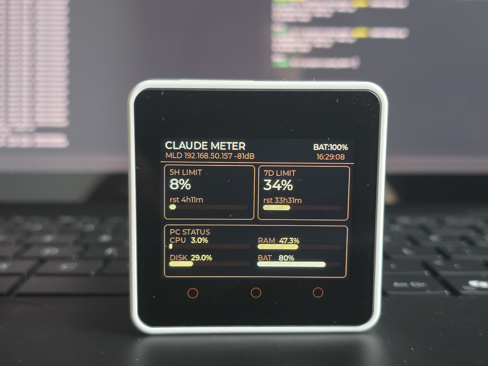
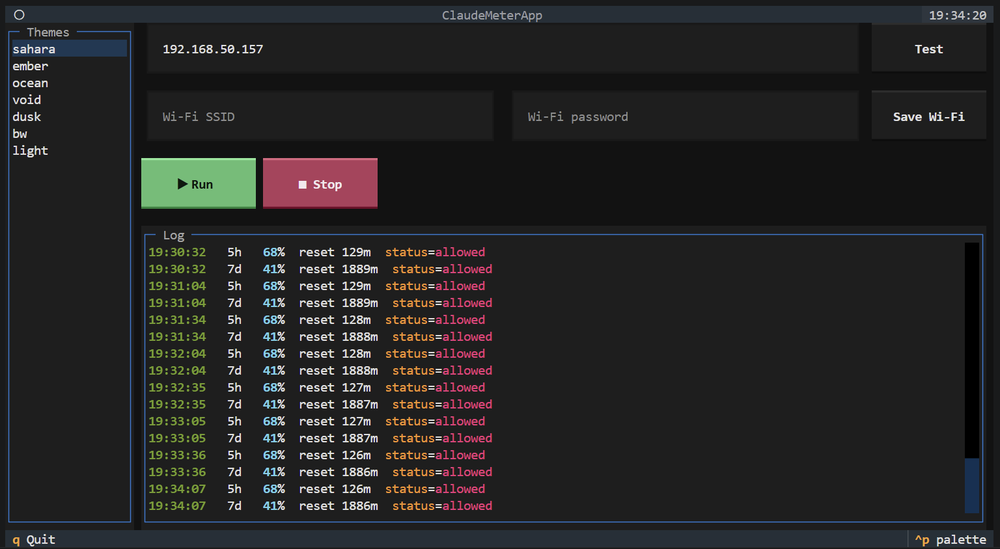

# Claude Meter

A physical dashboard for Claude Code rate-limit usage. A Python app on your PC reads the `anthropic-ratelimit-*` headers, mixes in local PC stats, and pushes live values to an **M5Stack Core2** over Wi-Fi.



## How it works

```
  api.anthropic.com         Your PC                    M5Stack Core2
  ─────────────────         ───────────────────────    ─────────────────
  ◄── POST /v1/messages ──  host/core/engine.py
  ──── rate-limit headers ► ├── data_source/claude_api.py
                            ├── data_source/pc_stats.py
                            └── core/device.py  ──────  device/main.py
                                  layout frame (once)   └── LVGL display
                                  update frame (5 s)
                                  wifi   frame (on demand)
```

- Every 30 s the engine fires a minimal `/v1/messages` request and reads the `anthropic-ratelimit-unified-*` response headers — no prompt is processed, no tokens are spent on content.
- On first connect it sends a **layout frame** (cards, widget positions, palette) derived from `host/config/layout.json`. On any send failure the layout is re-sent automatically on next connect.
- Every 5 s it sends an **update frame** with the current values: 5h/7d utilization %, reset countdown, CPU, RAM, disk, battery.
- A **wifi frame** can be sent on demand to change the device's stored Wi-Fi credentials over the network.

The device is optional — if no IP is configured (CLI) or set (TUI), the host still prints stats to the terminal.


## Requirements

**PC:** Python 3.11+, Claude Code installed and signed in (the host reads its OAuth token).

**Device:** M5Stack Core2 running UIFlow 2 firmware.

```bash
pip install -r requirements.txt        # runtime: httpx, psutil, textual
pip install -r requirements-dev.txt    # deploy tool: mpremote
```

## Setup

### 1. Deploy firmware

Connect the M5Stack via USB:

```bash
python tools/deploy.py                  # auto-detect port
python tools/deploy.py --port COM3      # or specify port
python tools/deploy.py --list           # list available ports
python tools/deploy.py --repl           # interactive REPL on the device
```

### 2. Configure Wi-Fi (first time, over USB)

```bash
python tools/deploy.py --config-set wifi_ssid=MyNetwork --config-set wifi_pass=secret
```

This writes `/flash/config.json` on the device. Supported keys:

| Key | Default | Description |
|---|---|---|
| `wifi_ssid` | `YOUR_SSID` | Wi-Fi network name |
| `wifi_pass` | `YOUR_PASSWORD` | Wi-Fi password |
| `tcp_port` | `5555` | TCP port the device listens on |

After the device boots and joins Wi-Fi, note its IP from the header on the display.

### 3. Run the host

You can drive the device from either the CLI or the TUI.

**CLI:**

```bash
cd host
python cli.py --ip 192.168.1.42
```

Sample output:

```
Running — Ctrl+C to stop
[claude] 5h   42%  reset 83m  status=normal
[claude] 7d   18%  reset 9603m  status=normal
[device] Layout sent  palette=sahara
[device] Send failed: ...        ← device unreachable, retries automatically
```

CLI flags:

| Flag | Description |
|---|---|
| `--ip ADDR` | **Required.** Device IP. |
| `--layout FILE` | Override `host/config/layout.json`. |
| `--palette NAME` | Theme name from `_themes` in `layout.json` (default `sahara`). |
| `--set-wifi-ssid SSID --set-wifi-pass PW` | Push new Wi-Fi credentials to the device and exit. Used together. |

**TUI:**



```bash
cd host
python tui.py
```

The TUI lets you pick a palette, set the device IP, test the connection, push the layout, run/stop the polling engine, and update the device's Wi-Fi credentials — all interactively. The chosen IP and palette persist in `host/config/tui_state.json`; Wi-Fi credentials are never persisted on the host.

## Updating Wi-Fi over the network

Once the device is on Wi-Fi, you can change its stored credentials without touching USB:

```bash
python cli.py --ip 192.168.1.42 --set-wifi-ssid NewNetwork --set-wifi-pass hunter2
```

Or in the TUI, fill in the Wi-Fi fields in the right panel and press **Save Wi-Fi**.

The device writes `/flash/config.json` and reboots immediately. If the new credentials are wrong it will fail to reconnect — recover over USB.

## Customising the layout

Everything visual lives in `host/config/layout.json` — palettes, card positions, widgets, colors. Edit the file and restart the host; the new layout is sent to the device on the next connect. No USB redeploy needed.

### Palettes

`layout.json` ships with several themes under `_themes` (e.g. `sahara`, `ember`, `ocean`, `void`, `dusk`, `bw`, `light`). Each theme defines six semantic color roles:

| Key | Role |
|---|---|
| `background` | Screen and card background |
| `border` | Card borders, divider lines, subdued labels |
| `secondary_light` | Medium-emphasis accent |
| `primary_dark` | Bar fills and secondary values |
| `primary_light` | Primary value text |
| `secondary_dark` | Progress bar track background |

Anywhere a `"color"` field appears in a widget, you can reference a palette key by name (`"primary_light"`) instead of hard-coding a hex value — colors are resolved against the active palette on the device.

### Widget types

| Type | Value from PC | Description |
|---|---|---|
| `static_s` / `static_l` | — | Fixed text, never updated |
| `label_s` / `label_l` | `str` | Dynamic text, small or large font |
| `named_label_s` / `named_label_l` | `str` | Static name prefix + dynamic value |
| `bar` | `int 0–100` | Progress fill |

Each widget references a value with `"source"` (e.g. `"claude.5h.usage.str"`, `"pc.cpu.usage.int"`); see `host/data_source/data_sources.py` for the full pool.

### Brightness

On the device, hold button **A** to decrease and **C** to increase screen brightness (steps of 10, clamped 10–100).

## Protocol

NDJSON over TCP, port 5555. One frame per connection — the host opens a socket, sends one newline-terminated JSON object, reads `OK\n`, and closes.

**Layout frame** (sent once per session, re-sent on reconnect):

```json
{
  "cmd": "layout",
  "palette": { "background": 0, "border": 6433556, "...": "..." },
  "groups": [
    {
      "id": "card_5h", "x": 6, "y": 45, "w": 150, "h": 92,
      "widgets": [
        { "id": "5h_val", "type": "label_l", "x": 8, "y": 18, "color": "primary_light" }
      ]
    }
  ]
}
```

**Update frame** (sent every 5 s):

```json
{
  "cmd": "update",
  "values": {
    "5h_val": "42%", "5h_rst": "rst 1h23m", "5h_bar": 42,
    "7d_val": "18%", "7d_rst": "rst 3d08h", "7d_bar": 18,
    "cpu":    "22%", "cpu_bar":  22,
    "ram":    "61%", "ram_bar":  61,
    "disk":   "48%", "disk_bar": 48,
    "bat":    "87%", "bat_bar":  87
  }
}
```

**Wi-Fi frame** (sent on demand; device acks `OK`, writes `/flash/config.json`, then reboots):

```json
{ "cmd": "wifi", "ssid": "MyNetwork", "password": "hunter2" }
```

## Acknowledgements

Special thanks to [@xrevv](https://github.com/xrevv) for the display brightness control mechanism and the color palettes.
